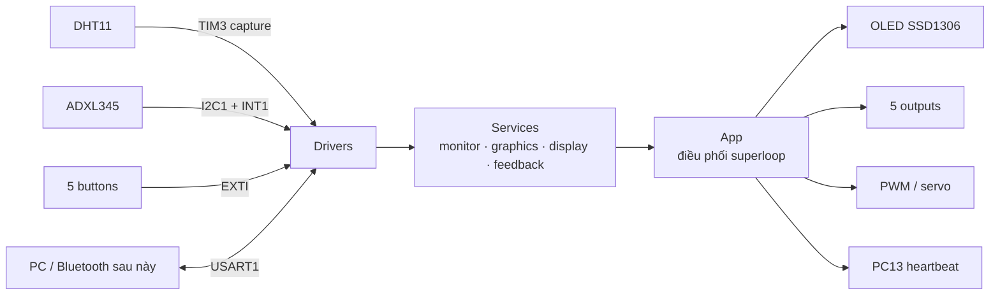

# Bluetooth Control Device

Firmware học tập cho **STM32F103C8T6 Blue Pill**, xây dựng bằng STM32CubeMX, STM32 HAL, CMake và kiến trúc superloop không RTOS. Project đọc nhiệt độ/độ ẩm và chuyển động, hiển thị lên OLED, nhận thao tác từ năm nút, điều khiển năm ngõ ra, PWM và giao tiếp UART.

> Project đang được phát triển theo từng module. Đây chưa phải sản phẩm hoàn thiện hoặc thiết kế cho môi trường an toàn-critical.

## Project làm được gì?

- Đọc DHT11 bằng TIM3 input capture và ngắt cạnh xuống.
- Đọc ADXL345 tại địa chỉ `0x53` qua I2C1, theo dõi tư thế và phát hiện rung/lắc.
- Điều khiển OLED SSD1306 128×64 tại địa chỉ `0x3C` trên cùng I2C1 bằng framebuffer 1024 byte.
- Hiển thị ba trang: Environment, Motion và Outputs.
- Nhận năm nút Up, Down, Left, Right và OK bằng EXTI có debounce.
- Điều khiển năm digital output và phát pattern cảnh báo.
- Tạo PWM bằng TIM1 channel 1.
- Giao tiếp USART1 hai chiều bằng ngắt, ring buffer và command console.
- Tự retry, probe lại địa chỉ OLED cố định và bus-clear khi I2C1 gặp lỗi.
- Nháy LED PC13 làm heartbeat để nhận biết firmware còn chạy.

## Bức tranh tổng thể



Luồng thực thi bắt đầu tại `main()`:

```text
CubeMX khởi tạo clock và peripheral
              ↓
        App_Initialize(...)
              ↓
while (1) → App_Service(HAL_GetTick()) → lặp liên tục
              ↑
       Callback ngắt chỉ ghi sự kiện ngắn
```

Các driver không chờ phần cứng hoàn thành trong vòng lặp. Giao dịch được bắt đầu, ISR ghi nhận sự kiện, rồi state machine xử lý tiếp trong `App_Service()`.

## Phần cứng hiện tại

| Chức năng | Chân / peripheral |
|---|---|
| UART với máy tính | USART1: PA9 TX, PA10 RX, 9600-8-N-1 |
| OLED SSD1306 | I2C1: PB6 SCL, PB7 SDA, địa chỉ 7-bit `0x3C` |
| ADXL345 | Dùng chung I2C1, địa chỉ 7-bit `0x53`, PB13 INT1 |
| DHT11 | PB1, TIM3 channel 4 input capture |
| PWM/servo | PA8, TIM1 channel 1 |
| Nút OK/Left/Right/Up/Down | PB0/PB3/PB4/PB5/PA15 |
| Digital output 1–5 | PB8/PB9/PB10/PB11/PB12 |
| Heartbeat LED | PC13, active-low |
| Debug | SWD: PA13 SWDIO, PA14 SWCLK |

Chi tiết mức logic, timer và lưu ý đấu nối nằm trong [docs/hardware.md](docs/hardware.md).

## Cấu trúc repository

```text
Bluetooth_Control_Device/
├── Core/                 # Code khởi tạo và callback do CubeMX quản lý
├── Drivers/              # STM32 HAL/CMSIS của ST, không phải thư viện tự viết
├── User/
│   ├── Board/            # Ánh xạ tên thiết bị vào tài nguyên phần cứng
│   ├── Drivers/          # Driver thiết bị và peripheral tự phát triển
│   ├── Services/         # Thuật toán, monitor, UI, feedback, console
│   └── App/              # Ghép module và điều phối toàn hệ thống
├── cmake/                # Toolchain và target CubeMX cho CMake
├── docs/                 # Tài liệu dành cho người học và người bảo trì
├── Bluetooth_Control_Device.ioc
├── CMakeLists.txt
└── CMakePresets.json
```

Đọc [docs/architecture.md](docs/architecture.md) để hiểu vai trò từng tầng và [docs/firmware-flow.md](docs/firmware-flow.md) để theo dấu dữ liệu từ cảm biến đến OLED/ngõ ra.

## Bắt đầu nhanh

### Công cụ cần có

- STM32CubeMX hoặc STM32Cube for Visual Studio Code.
- Arm GNU Toolchain `arm-none-eabi-gcc`.
- CMake 3.22 trở lên và Ninja.
- ST-Link V2 và STM32Cube ST-Link GDB Server để nạp/debug.

### Build

```powershell
cmake --preset Debug
cmake --build --preset Debug
```

| Preset | Mục đích |
|---|---|
| `Debug` | Dễ quan sát biến và debug nhất, kích thước lớn hơn |
| `SizeDebug` | Có thông tin debug nhưng tối ưu kích thước |
| `Release` | Tối ưu cho firmware phát hành |

Hướng dẫn đầy đủ nằm tại [docs/getting-started.md](docs/getting-started.md).

## Điều khiển

- Left/Right: đổi trang OLED.
- Up/Down: đổi output đang chọn tại trang Outputs.
- OK tại trang Outputs: bật/tắt output được chọn.
- OK tại trang Environment hoặc Motion: kích hoạt manual warning.

Command UART hiện có:

```text
help
echo [arg ...]
```

Mỗi command kết thúc bằng `\r`, `\n` hoặc `\r\n`.

## Cảnh báo quan trọng

`APP_SERVO_PWM_LED_TEST_ENABLED` hiện bằng `1`: PWM tự chạy các mức 0%, gần 100%, 25%, 50% và 75% để thử bằng LED. **Không nối servo thật khi chế độ này còn bật.**

Project chưa có PCB riêng. Hãy kiểm tra điện áp, nguồn cấp, mass chung và điện trở pull-up I2C trước khi nối module.

## Tài liệu

- [Bắt đầu và build project](docs/getting-started.md)
- [Phần cứng và bảng chân](docs/hardware.md)
- [Kiến trúc firmware](docs/architecture.md)
- [Luồng hoạt động và luồng dữ liệu](docs/firmware-flow.md)
- [Kịch bản kiểm thử toàn hệ thống](docs/testing.md)
- [Quy tắc đóng góp và CubeMX](CONTRIBUTING.md)
