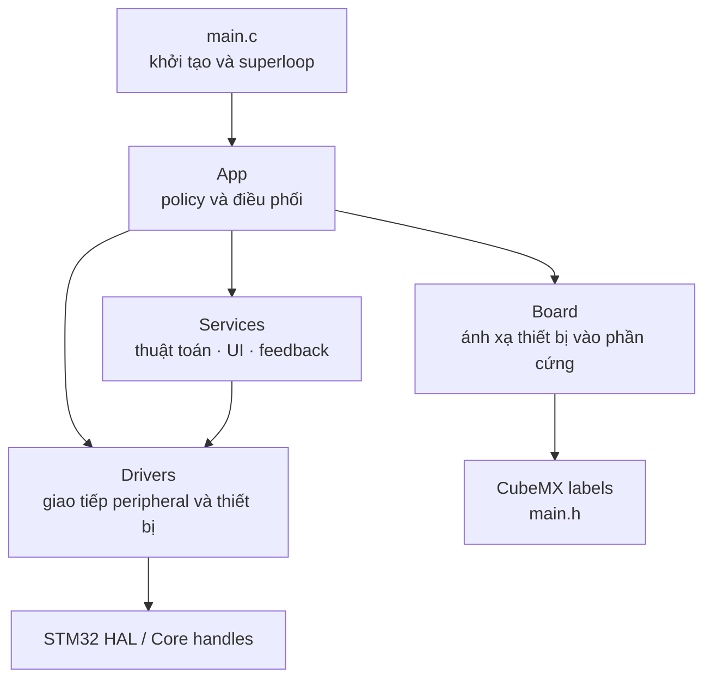

# Kiến trúc firmware

## Vì sao chia tầng?

Một firmware dễ bảo trì cần tách ba câu hỏi:

1. Phần cứng nào đang được MCU sử dụng?
2. Dữ liệu từ thiết bị được đọc/ghi như thế nào?
3. Hệ thống quyết định làm gì với dữ liệu đó?

Project trả lời bằng bốn vùng trách nhiệm `Board`, `Drivers`, `Services` và `App`.
Các mũi tên dưới đây biểu diễn **quan hệ phụ thuộc của source**: module ở đầu
mũi tên sử dụng API hoặc kiểu dữ liệu của module ở cuối mũi tên.



Đây không phải luồng dữ liệu runtime. Dữ liệu khi firmware chạy thường đi theo
chiều `cảm biến → driver → service → App → OLED/ngõ ra`, trong khi thao tác nút
đi theo chiều `EXTI → driver nút → App → service/driver đầu ra`. Vì hai khái niệm
này khác nhau nên sơ đồ phụ thuộc phía trên không tạo vòng tròn.

## `Core/`: code do CubeMX quản lý

`Core/` chứa clock tree, hàm `MX_*_Init()`, interrupt handler và HAL callback. Khi CubeMX sinh lại code, chỉ phần nằm giữa cặp `USER CODE BEGIN/END` được bảo toàn.

Vai trò chính của `main.c`:

```c
MX_GPIO_Init();
MX_I2C2_Init();
MX_USART2_UART_Init();
MX_I2C1_Init();
MX_TIM3_Init();
MX_TIM2_Init();

App_Initialize(...);

while (1)
{
    App_Service(HAL_GetTick());
}
```

`main.c` không cần biết state machine nội bộ của từng thiết bị.

## `User/Board/`: bản đồ phần cứng

`board_config.h` nối tên thiết bị ở tầng ứng dụng với label do CubeMX sinh, ví dụ:

```c
#define BOARD_DHT11_DATA_PORT CAPTURE_IO_1_GPIO_Port
#define BOARD_DHT11_DATA_PIN  CAPTURE_IO_1_Pin
```

CubeMX vẫn là nguồn cấu hình chân thực tế. `board_config.h` không biến GPIO thường thành I2C hay timer; nó chỉ giúp code tầng trên không phụ thuộc trực tiếp vào PA/PB cụ thể.

## `User/Drivers/`: giao tiếp với phần cứng

Driver biết giao thức hoặc peripheral, nhưng không quyết định hành vi tổng thể của sản phẩm.

| Driver | Trách nhiệm |
|---|---|
| `i2c_bus` | Gửi, đọc register, scan và probe I2C bằng ngắt |
| `i2c_bus_recovery` | Bus-clear bằng tối đa 9 xung SCL và tạo STOP |
| `uart_stream` | RX/TX UART bằng ngắt và ring buffer tĩnh |
| `dht11` | Start signal, input capture và kiểm tra frame DHT11 |
| `adxl345` | Nhận dạng, cấu hình và đọc mẫu ADXL345 |
| `ssd1306` | Framebuffer, command và refresh OLED |
| `button_input` | Nhận EXTI và debounce nút |
| `gpio_output` | Điều khiển output với active-level cấu hình được |
| `pwm_output` | Điều khiển pulse width theo microsecond |

Driver không dùng bộ nhớ động. Buffer thuộc context tĩnh và có kích thước cố định.

## `User/Services/`: xử lý dữ liệu và trình bày

Service chủ yếu là thuật toán hoặc policy, không trực tiếp cấu hình peripheral.

| Nhóm | Module tiêu biểu | Kết quả |
|---|---|---|
| Monitor | `environment_monitor`, `motion_monitor` | Fresh/stale, điều kiện môi trường, tư thế, still/moving/shaking |
| Display | `environment_display`, `motion_display`, `output_display` | Nội dung một trang OLED |
| Graphics | `mono_graphics`, `mono_font_5x7` | Pixel, chữ và hình cơ bản |
| Feedback | `environment_feedback`, `warning_feedback` | Nguồn warning và pattern năm LED |
| Control | `output_control` | Output được chọn và mask ON/OFF |
| UART | `command_console`, `uart_log` | Ghép dòng lệnh và log kiểu `printf` |

## `User/App/`: nơi ghép toàn bộ hệ thống

`App_Initialize()` tạo các context và nối chúng với handle HAL. `App_Service()` tiến từng state machine một bước trong mỗi vòng superloop.

App áp dụng policy liên-module:

- Nút OK có ý nghĩa khác nhau tùy trang OLED.
- Warning có thể đến từ manual, môi trường hoặc shaking.
- Warning tạm chiếm năm output nhưng trạng thái người dùng vẫn được giữ.
- Lỗi OLED không được làm DHT11, ADXL345, UART và heartbeat ngừng chạy.

## Header và source khác nhau thế nào?

- File `.h` công bố kiểu dữ liệu và API cho module khác dùng.
- File `.c` chứa thân hàm và biến nội bộ.
- Biến `static` trong `.c` chỉ thuộc module đó nhưng tồn tại suốt thời gian firmware chạy.
- Biến cục bộ thông thường tồn tại trong lúc hàm đang chạy và hết hiệu lực khi hàm trả về.

## Quy tắc ngắt

ISR chỉ làm phần việc có hạn:

1. Chụp dữ liệu hoặc ghi cờ sự kiện.
2. Trả quyền điều khiển sớm.
3. Driver service xử lý phần dài hơn trong main context.

Cách này giúp TIM3 input capture, I2C, UART và nút cùng hoạt động mà không nhét thuật toán dài vào interrupt handler.
