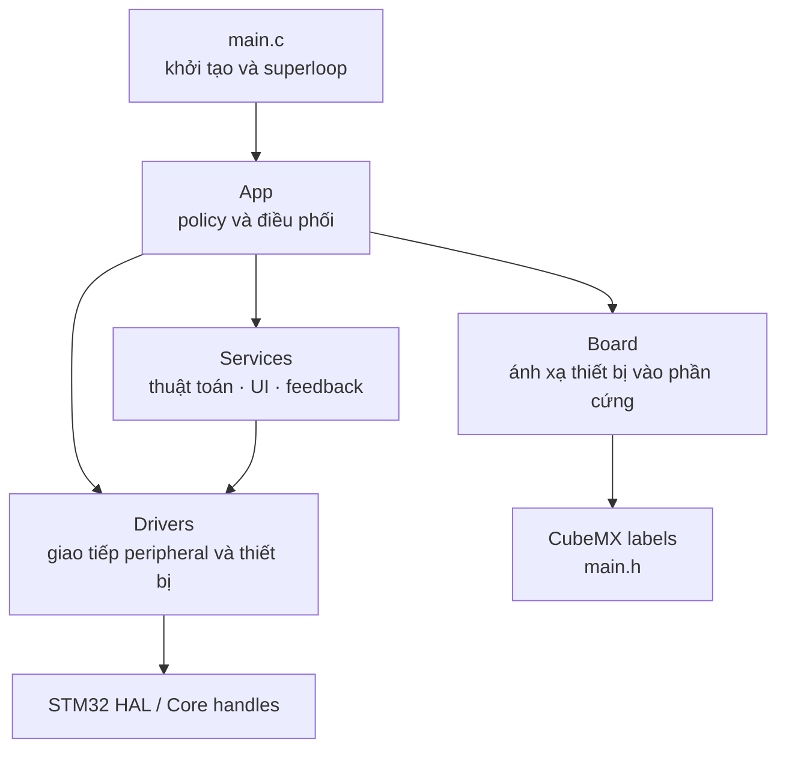
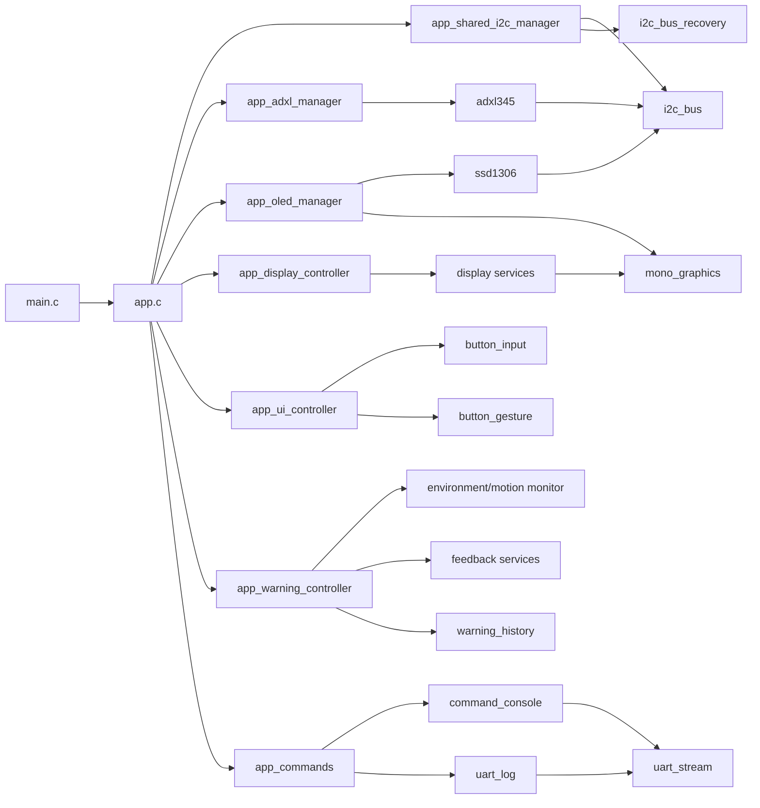

# Kiến trúc firmware

## Vì sao chia tầng?

Một firmware dễ bảo trì cần tách ba câu hỏi:

1. Phần cứng nào đang được MCU sử dụng?
2. Dữ liệu từ thiết bị được đọc/ghi như thế nào?
3. Hệ thống quyết định làm gì với dữ liệu đó?

Project trả lời bằng bốn vùng trách nhiệm `Board`, `Drivers`, `Services` và `App`.
Các mũi tên dưới đây biểu diễn **quan hệ phụ thuộc của source**: module ở đầu
mũi tên sử dụng API hoặc kiểu dữ liệu của module ở cuối mũi tên.



## Dependency theo từng module

Trong phần này, mũi tên `A --> B` có nghĩa là **A sử dụng API, kiểu dữ liệu hoặc
sở hữu context của B**. Đây vẫn là dependency của source, không phải thứ tự chạy
trong một vòng superloop. Các header chuẩn C và dependency cuối cùng tới STM32
HAL được lược bớt để sơ đồ dễ đọc.



### Module thuộc `User/App`

| Module | Dependency trực tiếp chính |
|---|---|
| `app.c` | Toàn bộ controller/manager bên dưới; `dht11`, `environment_monitor`, `environment_history`, `motion_monitor`, `monitoring_session`, `output_control`, `gpio_output`, `pwm_output`, `system_heartbeat`, `uart_stream`, `uart_log`, `command_console` và `board_config` |
| `app_shared_i2c_manager` | `i2c_bus`, `i2c_bus_recovery` |
| `app_adxl_manager` | `adxl345` |
| `app_oled_manager` | `ssd1306`, `mono_graphics` |
| `app_display_controller` | `environment_display`, `environment_history_display`, `motion_display`, `warning_history_display`, `output_display`; nhận kiểu trạng thái từ `adxl345` và page từ `app_ui_controller` |
| `app_ui_controller` | `button_input`, `button_gesture` |
| `app_warning_controller` | `environment_feedback`, `motion_monitor`, `warning_feedback`, `warning_history` |
| `app_commands` | `command_console`, `uart_log`, `monitoring_session`, `app_config` |

### Module thuộc `User/Services`

| Module | Dependency trực tiếp chính |
|---|---|
| `environment_monitor` | `dht11` |
| `environment_feedback` | `environment_monitor` |
| `environment_history` | `environment_monitor` |
| `motion_monitor` | Không phụ thuộc driver; nhận mẫu gia tốc đã chuẩn hóa từ App |
| `environment_display` | `environment_monitor`, `environment_feedback`, `mono_graphics`, `mono_font_5x7` |
| `environment_history_display` | `environment_history`, `mono_graphics`, `mono_font_5x7` |
| `motion_display` | `adxl345`, `motion_monitor`, `mono_graphics`, `mono_font_5x7` |
| `warning_history_display` | `warning_history`, `mono_graphics`, `mono_font_5x7` |
| `output_display` | `output_control`, `mono_graphics`, `mono_font_5x7` |
| `command_console` | `uart_stream` |
| `uart_log` | `uart_stream` |
| `button_gesture`, `monitoring_session`, `output_control`, `system_heartbeat`, `warning_feedback`, `warning_history` | Không phụ thuộc module project-owned khác |
| `mono_font_5x7` | `mono_graphics` |
| `mono_graphics` | Không phụ thuộc driver hay HAL |

### Module thuộc `User/Drivers`

| Module | Dependency trực tiếp chính |
|---|---|
| `adxl345` | `i2c_bus` |
| `ssd1306` | `i2c_bus` |
| `i2c_bus`, `i2c_bus_recovery` | STM32 HAL |
| `dht11`, `button_input`, `gpio_output`, `pwm_output`, `uart_stream` | STM32 HAL |

Các dependency dùng chung như `i2c_bus`, `mono_graphics` và `uart_stream` xuất
hiện ở nhiều nhánh là có chủ ý. Context runtime của chúng vẫn có một owner rõ
ràng; ví dụ `app_shared_i2c_manager` sở hữu context I2C1 duy nhất, còn OLED và
ADXL345 chỉ giữ con trỏ tới context đó.

Đây không phải luồng dữ liệu runtime. Dữ liệu khi firmware chạy thường đi theo
chiều `cảm biến → driver → service → App → OLED/ngõ ra`, trong khi thao tác nút
đi theo chiều `EXTI → driver nút → App → service/driver đầu ra`. Vì hai khái niệm
này khác nhau nên sơ đồ phụ thuộc phía trên không tạo vòng tròn.

## `Core/`: code do CubeMX quản lý

`Core/` chứa clock tree, hàm `MX_*_Init()`, interrupt handler và HAL callback. Khi CubeMX sinh lại code, chỉ phần nằm giữa cặp `USER CODE BEGIN/END` được bảo toàn.

Vai trò chính của `main.c`:

```c
MX_GPIO_Init();
MX_I2C1_Init();
MX_TIM3_Init();
MX_ADC1_Init();      /* tài nguyên dự phòng, App chưa sử dụng */
MX_SPI1_Init();      /* tài nguyên dự phòng, App chưa sử dụng */
MX_TIM1_Init();
MX_USART1_UART_Init();

App_Initialize(...);

while (1)
{
    App_Service(HAL_GetTick());
}
```

`main.c` không cần biết state machine nội bộ của từng thiết bị.

## `User/Board/`: bản đồ phần cứng

`board_config.h` nối tên thiết bị ở tầng ứng dụng với label do CubeMX sinh, ví dụ:

```c
#define BOARD_DHT11_DATA_PORT CAPTURE_INPUT_1_GPIO_Port
#define BOARD_DHT11_DATA_PIN  CAPTURE_INPUT_1_Pin
```

CubeMX vẫn là nguồn cấu hình chân thực tế. `board_config.h` không biến GPIO thường thành I2C hay timer; nó chỉ giúp code tầng trên không phụ thuộc trực tiếp vào PA/PB cụ thể.

## `User/Drivers/`: giao tiếp với phần cứng

Driver biết giao thức hoặc peripheral, nhưng không quyết định hành vi tổng thể của sản phẩm.

| Driver | Trách nhiệm |
|---|---|
| `i2c_bus` | Phân xử một giao dịch tại một thời điểm; gửi, đọc register, scan và probe I2C bằng ngắt |
| `i2c_bus_recovery` | Bus-clear bằng tối đa 9 xung SCL và tạo STOP |
| `uart_stream` | RX/TX UART bằng ngắt và ring buffer tĩnh |
| `dht11` | Start signal, input capture và kiểm tra frame DHT11 |
| `adxl345` | Nhận dạng, cấu hình và đọc mẫu ADXL345 |
| `ssd1306` | Framebuffer, command và refresh OLED |
| `button_input` | Nhận EXTI và debounce nút |
| `gpio_output` | Điều khiển output với active-level cấu hình được |
| `pwm_output` | Điều khiển pulse width theo microsecond |

Driver không dùng bộ nhớ động. Buffer thuộc context tĩnh và có kích thước cố định.

## `User/Services/`: xử lý dữ liệu và trình bày

Service chủ yếu là thuật toán hoặc policy, không trực tiếp cấu hình peripheral.

| Nhóm | Module tiêu biểu | Kết quả |
|---|---|---|
| Monitor | `environment_monitor`, `motion_monitor` | Fresh/stale, điều kiện môi trường, tư thế, still/moving/shaking |
| Display | `environment_display`, `environment_history_display`, `warning_history_display`, `motion_display`, `output_display` | Nội dung một trang OLED |
| Graphics | `mono_graphics`, `mono_font_5x7` | Pixel, chữ và hình cơ bản |
| Feedback | `environment_feedback`, `warning_feedback` | Nguồn warning và pattern năm LED |
| Control | `output_control` | Output được chọn và mask ON/OFF |
| History | `environment_history`, `warning_history` | Ring buffer RAM của giao dịch DHT11 và chuyển tiếp warning |
| Session | `monitoring_session` | Bật/tắt ghi history và warning tự động theo phiên |
| Input logic | `button_gesture` | Phân biệt nhấn ngắn và giữ nút OK |
| UART | `command_console`, `uart_log` | Ghép dòng lệnh và log kiểu `printf` |

## `User/App/`: nơi ghép toàn bộ hệ thống

`App_Initialize()` tạo các context và nối chúng với handle HAL. `App_Service()` tiến từng state machine một bước trong mỗi vòng superloop. `app_ui_controller` sở hữu năm button context, gesture OK và page đang chọn để `app.c` chỉ nhận các event UI đã có nghĩa. `app_warning_controller` sở hữu context phản hồi môi trường, pattern LED và warning history; module này tổng hợp các nguồn warning rồi trả về mask output hiệu lực mà không truy cập GPIO, UART hay OLED. `app_display_controller` sở hữu năm display context, xử lý tương tác riêng của hai trang history và chọn page cần vẽ; controller chỉ ghi lên canvas được cung cấp.

Ba manager liên quan tới I2C có ranh giới riêng: `app_shared_i2c_manager` sở hữu duy nhất context I2C1 và bus-clear vật lý; `app_oled_manager` sở hữu framebuffer/driver SSD1306 cùng policy retry/offline; `app_adxl_manager` sở hữu driver ADXL345, theo dõi lỗi đọc/stale và tự khởi tạo lại cảm biến. Hai device manager chỉ phát yêu cầu phục hồi bus, không trực tiếp điều khiển PB6/PB7.

App áp dụng policy liên-module:

- Nút OK có ý nghĩa khác nhau tùy trang OLED.
- Warning có thể đến từ manual, môi trường hoặc shaking.
- Warning tạm chiếm năm output nhưng trạng thái người dùng vẫn được giữ.
- OLED manager và ADXL manager chia sẻ context I2C1 do shared-I2C manager sở hữu; driver không được tự tạo giao dịch khi bus đang bận.
- Một device manager có thể yêu cầu phục hồi bus. Shared-I2C manager thực thi tối đa hai lần bus-clear, còn `app.c` tạm dừng cả hai device rồi chuyển kết quả phục hồi cho cả hai.
- ADXL manager restart riêng cảm biến sau 3 lần đọc lỗi liên tiếp hoặc stale liên tục 2 giây; khi offline, nó thử nhận dạng và cấu hình lại mỗi 2 giây.
- Lỗi I2C không được làm DHT11, UART, nút và heartbeat ngừng chạy.

## Header và source khác nhau thế nào?

- File `.h` công bố kiểu dữ liệu và API cho module khác dùng.
- File `.c` chứa thân hàm và biến nội bộ.
- Biến `static` trong `.c` chỉ thuộc module đó nhưng tồn tại suốt thời gian firmware chạy.
- Biến cục bộ thông thường tồn tại trong lúc hàm đang chạy và hết hiệu lực khi hàm trả về.

## Quy tắc ngắt

ISR chỉ làm phần việc có hạn:

1. Chụp dữ liệu hoặc ghi cờ sự kiện.
2. Trả quyền điều khiển sớm.
3. Driver service xử lý phần dài hơn trong main context.

Cách này giúp TIM3 input capture, I2C, UART và nút cùng hoạt động mà không nhét thuật toán dài vào interrupt handler.
