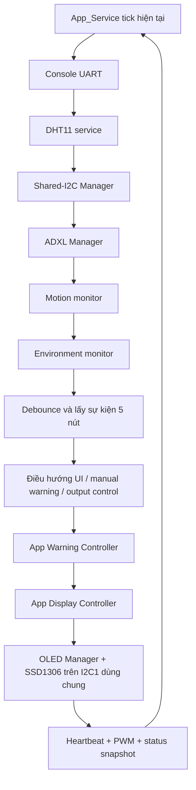
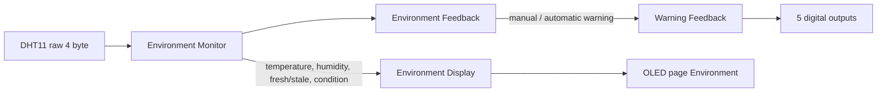
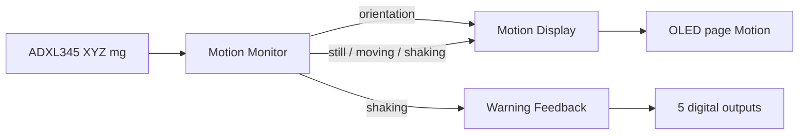
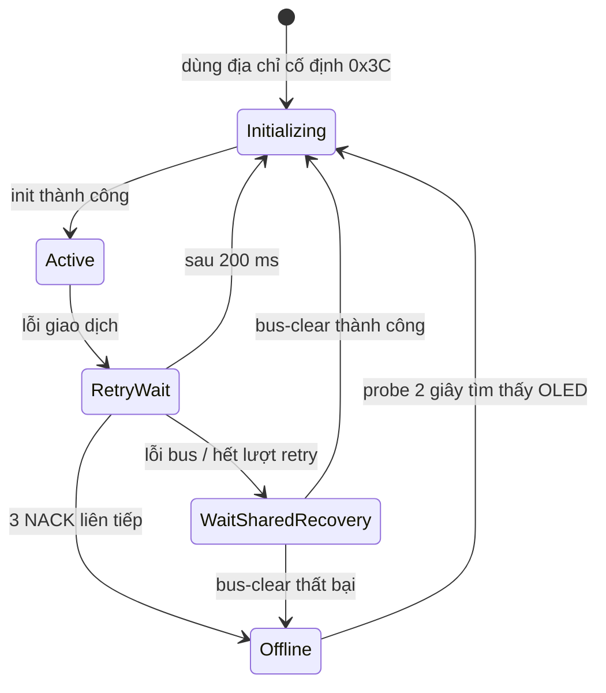

# Luồng hoạt động và luồng dữ liệu

## Một vòng superloop



Không bước nào chờ một peripheral hoàn thành. Nếu I2C đang truyền, vòng lặp vẫn phục vụ cảm biến, nút, UART và heartbeat.

## DHT11 → Environment → phản hồi



Các ngưỡng hiện tại:

- Warm từ 28 °C.
- Humid từ 65%.
- Chỉ `WARM_AND_HUMID` là automatic warning.
- Không có mẫu hợp lệ mới trong 6 giây thì dữ liệu stale; mẫu hợp lệ cuối vẫn được giữ.

Manual warning được bật bằng OK tại trang Environment hoặc Motion. Mẫu DHT11 hợp lệ tiếp theo gỡ nguồn manual; nếu môi trường thật sự warm-and-humid thì nguồn automatic tiếp tục giữ warning.

## ADXL345 → Motion → phản hồi



Motion monitor lọc thành phần trọng lực để suy ra hướng ±X/±Y/±Z và dùng phần chuyển động còn lại để phân loại still, moving hoặc shaking.

## Nút và năm trang OLED

```text
Left/Right: Environment ⇄ Environment History ⇄ Motion ⇄ Warning History ⇄ Outputs

Trang Environment/Motion:
    Nhấn OK → manual warning

Hai trang History:
    Up/Down → cuộn record
    Nhấn OK → danh sách/chi tiết

Trang Outputs:
    Up/Down → đổi output đang chọn
    Nhấn OK → bật/tắt output đó

Mọi trang:
    Giữ OK → bật/tắt phiên giám sát
```

Khi warning chạy, `output_control` vẫn giữ mask người dùng. `app_warning_controller` trả `effective_output_mask` từ pattern cảnh báo; khi tất cả nguồn warning biến mất, mask hiệu lực trở lại trạng thái người dùng đã lưu. Controller chỉ thực hiện policy phần mềm, còn `app.c` mới áp mask xuống GPIO và log record mới qua UART.

`app_display_controller` nhận snapshot của environment, motion, output và warning để cập nhật năm page. Controller chọn đúng page cần render vào canvas. `app_oled_manager` sở hữu canvas và SSD1306, gọi controller qua callback rồi chỉ yêu cầu gửi framebuffer khi controller báo một frame vừa được vẽ thành công.

Environment History hiển thị nhiệt độ/độ ẩm và trạng thái cảm biến, không hiển thị phân loại LOW/NORMAL/HIGH. Warning History hiển thị START/CHANGE/CLEAR, thời điểm và phiên; M/E/S trong danh sách là MANUAL/ENV/SHAKING. Chi tiết SOURCE AFTER là tổ hợp nguồn sau sự kiện, vì vậy CLEAR hiển thị NONE. Khi record đang xem bị ring buffer ghi đè, lựa chọn dừng ở record cũ nhất còn giữ được.

## OLED, ADXL345 và phục hồi I2C1

Framebuffer SSD1306 gồm 1024 byte. Driver khóa framebuffer trong lúc truyền để graphics không ghi đè dữ liệu HAL đang mượn.



`app_oled_manager` giữ policy retry/offline/probe của OLED. `app_adxl_manager` giữ policy riêng của cảm biến: cảnh báo stale sau 200 ms, restart sau 3 lỗi đọc liên tiếp hoặc stale kéo dài 2 giây, và thử khởi tạo lại mỗi 2 giây khi offline. Sau khi restart, 3 mẫu tốt liên tiếp xác nhận cảm biến online.

Khi một device phát yêu cầu bus recovery, `app_shared_i2c_manager` tạm DeInit I2C1, chuyển PB6/PB7 thành GPIO open-drain, phát tối đa 9 xung SCL, tạo STOP rồi gọi lại `HAL_I2C_Init()`. Manager thử tối đa 2 lần, cách nhau 300 ms. `app.c` không service OLED/ADXL trong thời gian đó và chuyển kết quả phục hồi cho cả hai vì context bus dùng chung đã được tạo lại.

Hàm scan toàn dải địa chỉ vẫn tồn tại trong driver `i2c_bus`, nhưng luồng App hiện không gọi nó. OLED dùng cố định `0x3C`; ADXL345 dùng cố định `0x53` và chỉ đọc thanh ghi `DEVID` để xác minh đúng loại thiết bị.

## UART

USART1 RX nhận từng byte bằng ngắt và đưa vào ring buffer. `command_console` lấy byte trong main context, ghép dòng khi gặp `\r`/`\n`, sau đó `app_commands` tìm handler.

TX cũng dùng ring buffer và interrupt. `UartLog_Printf()` định dạng vào buffer tĩnh rồi xếp byte để gửi; nó không chờ UART truyền xong.

Log retry/offline/phục hồi bus chỉ được phát khi trạng thái thay đổi, không phát định kỳ ở trạng thái ổn định.
