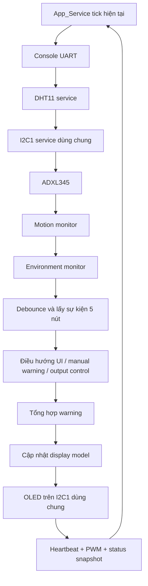
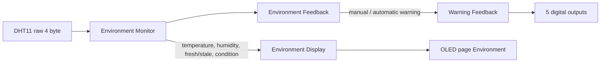
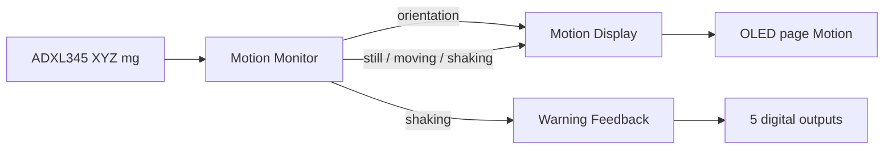
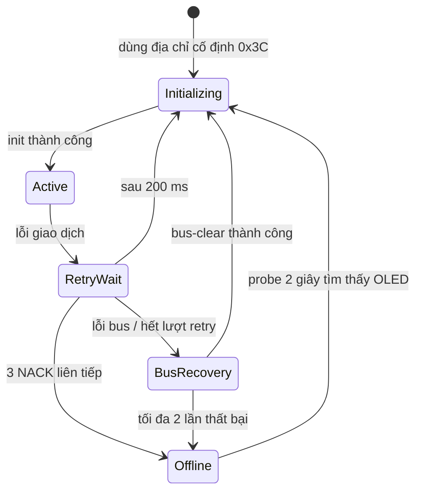

# Luồng hoạt động và luồng dữ liệu

## Một vòng superloop



Không bước nào chờ một peripheral hoàn thành. Nếu I2C đang truyền, vòng lặp vẫn phục vụ cảm biến, nút, UART và heartbeat.

## DHT11 → Environment → phản hồi



Các ngưỡng hiện tại:

- Warm từ 28 °C.
- Humid từ 65%.
- Chỉ `WARM_AND_HUMID` là automatic warning.
- Không có mẫu hợp lệ mới trong 6 giây thì dữ liệu stale; mẫu hợp lệ cuối vẫn được giữ.

Manual warning được bật bằng OK tại trang Environment hoặc Motion. Mẫu DHT11 hợp lệ tiếp theo gỡ nguồn manual; nếu môi trường thật sự warm-and-humid thì nguồn automatic tiếp tục giữ warning.

## ADXL345 → Motion → phản hồi



Motion monitor lọc thành phần trọng lực để suy ra hướng ±X/±Y/±Z và dùng phần chuyển động còn lại để phân loại still, moving hoặc shaking.

## Nút và ba trang OLED

```text
Left/Right: Environment ⇄ Motion ⇄ Outputs

Trang Environment/Motion:
    OK → manual warning

Trang Outputs:
    Up/Down → đổi output đang chọn
    OK      → bật/tắt output đó
```

Khi warning chạy, `output_control` vẫn giữ mask người dùng. `effective_output_mask` tạm lấy pattern cảnh báo. Khi tất cả nguồn warning biến mất, output trở lại mask đã lưu.

## OLED và phục hồi I2C1

Framebuffer SSD1306 gồm 1024 byte. Driver khóa framebuffer trong lúc truyền để graphics không ghi đè dữ liệu HAL đang mượn.



Bus-clear tạm DeInit I2C1, chuyển PB6/PB7 thành GPIO open-drain, phát tối đa 9 xung SCL, tạo STOP rồi gọi lại `HAL_I2C_Init()`. Vì ADXL345 cũng nằm trên I2C1, App không cho cảm biến bắt đầu giao dịch mới trong lúc chờ/phục hồi bus và khởi tạo lại state machine ADXL345 khi bus-clear thành công.

Hàm scan toàn dải địa chỉ vẫn tồn tại trong driver `i2c_bus`, nhưng luồng App hiện không gọi nó. OLED dùng cố định `0x3C`; ADXL345 dùng cố định `0x53` và chỉ đọc thanh ghi `DEVID` để xác minh đúng loại thiết bị.

## UART

USART1 RX nhận từng byte bằng ngắt và đưa vào ring buffer. `command_console` lấy byte trong main context, ghép dòng khi gặp `\r`/`\n`, sau đó `app_commands` tìm handler.

TX cũng dùng ring buffer và interrupt. `UartLog_Printf()` định dạng vào buffer tĩnh rồi xếp byte để gửi; nó không chờ UART truyền xong.

Log retry/offline/phục hồi bus chỉ được phát khi trạng thái thay đổi, không phát định kỳ ở trạng thái ổn định.
