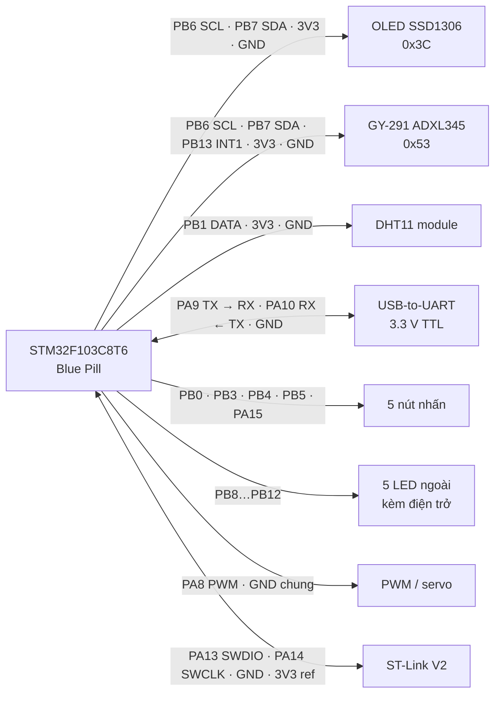

# Phần cứng và kết nối

## Vi điều khiển và clock

- MCU: STM32F103C8T6, package LQFP48.
- Board đang dùng: Blue Pill development board.
- Clock runtime hiện tại: HSI 8 MHz.
- SWD được giữ trên PA13/PA14; JTAG không được sử dụng.
- Linker script khai báo 64 KiB Flash và 20 KiB RAM.

## Bảng chân

| Chân | Label CubeMX | Vai trò hiện tại | Cấu hình chính |
|---|---|---|---|
| PC13 | `BOARD_STATUS_LED` | Heartbeat | Output, active-low |
| PA0–PA3 | `ANALOG_INPUT_1..4` | Dự phòng ADC | ADC1; App chưa sử dụng |
| PA4 | `SPI_PORT_1_CS_1` | Dự phòng chip-select 1 | GPIO output; App chưa sử dụng |
| PA5/PA6/PA7 | `SPI_PORT_1_SCK/MISO/MOSI` | Dự phòng SPI | SPI1; App chưa sử dụng |
| PA8 | `PWM_OUTPUT_1` | PWM/servo | TIM1 CH1 |
| PA9 | `UART_PORT_1_TX` | PC UART TX | USART1 |
| PA10 | `UART_PORT_1_RX` | PC UART RX | USART1 |
| PA15 | `DIGITAL_INPUT_5` | Down | EXTI falling, pull-up |
| PB0 | `DIGITAL_INPUT_1` | OK | EXTI falling, pull-up |
| PB1 | `CAPTURE_INPUT_1` | DHT11 DATA | TIM3 CH4 falling capture, filter 4 |
| PB3 | `DIGITAL_INPUT_2` | Left | EXTI falling, pull-up |
| PB4 | `DIGITAL_INPUT_3` | Right | EXTI falling, pull-up |
| PB5 | `DIGITAL_INPUT_4` | Up | EXTI falling, pull-up |
| PB6 | `I2C_PORT_1_SCL` | I2C dùng chung | I2C1, 100 kHz |
| PB7 | `I2C_PORT_1_SDA` | I2C dùng chung | I2C1, 100 kHz |
| PB8–PB12 | `DIGITAL_OUTPUT_1..5` | Output 1–5 | GPIO active-high |
| PB13 | `DIGITAL_INPUT_6` | ADXL345 INT1 | EXTI13 rising, no-pull |
| PB14/PB15 | `SPI_PORT_1_CS_2/3` | Dự phòng chip-select 2–3 | GPIO output; App chưa sử dụng |
| PA13 | — | SWDIO | System debug |
| PA14 | — | SWCLK | System debug |

## Sơ đồ nối dây hiện tại

Sơ đồ dưới đây dùng tên chân MCU in trên Blue Pill, không phụ thuộc vị trí vật lý
của hai hàng header. Tất cả module phải dùng chung GND.



### OLED và ADXL345 trên I2C1 dùng chung

| Blue Pill | OLED SSD1306 | ADXL345 GY-291 | Ghi chú |
|---|---|---|---|
| 3V3 | VCC | VCC | Dùng 3,3 V để giữ mức logic I2C an toàn cho STM32 |
| GND | GND | GND | Mass chung |
| PB6 | SCL | SCL | I2C1 SCL, 100 kHz |
| PB7 | SDA | SDA | I2C1 SDA, 100 kHz |
| PB13 | — | INT1 | DATA_READY, EXTI cạnh lên |
| 3V3 | — | CS | Kéo mức cao để chọn chế độ I2C |
| GND | — | SDO/ALT ADDRESS | Mức thấp chọn địa chỉ 7-bit `0x53` |

Không để `CS` hoặc `SDO` của ADXL345 trôi mức. Nếu module đã nối cố định hai chân
này trên PCB thì không cần nối lặp lại, nhưng phải kiểm tra ký hiệu hoặc schematic
của đúng module đang dùng.

### DHT11

| Blue Pill | DHT11 module |
|---|---|
| 3V3 | VCC |
| GND | GND |
| PB1 | DATA |

Module DHT11 hiện dùng đã có điện trở pull-up trên DATA. Không cần mắc thêm một
điện trở pull-up song song nếu chưa đo hoặc kiểm tra giá trị có sẵn.

### Nút nhấn

Mỗi nút chỉ cần nối giữa chân input tương ứng và GND vì CubeMX đã bật pull-up nội:

| Chức năng | Chân Blue Pill | Đầu còn lại của nút |
|---|---|---|
| OK/Enter | PB0 | GND |
| Left | PB3 | GND |
| Right | PB4 | GND |
| Up | PB5 | GND |
| Down | PA15 | GND |

### Năm LED output

Mỗi ngõ ra active-high được nối riêng theo cùng một mẫu:

```text
PB8/PB9/PB10/PB11/PB12 ── điện trở 220 Ω…1 kΩ ── anode LED
                                                        cathode LED ── GND
```

| Output | Chân Blue Pill |
|---|---|
| OUT1 | PB8 |
| OUT2 | PB9 |
| OUT3 | PB10 |
| OUT4 | PB11 |
| OUT5 | PB12 |

### UART và nạp/debug

| Blue Pill | USB-to-UART |
|---|---|
| PA9 / USART1 TX | RX |
| PA10 / USART1 RX | TX |
| GND | GND |

USB-to-UART phải dùng mức logic 3,3 V. TX/RX phải nối chéo; không nối chân cấp
nguồn của adapter nếu Blue Pill đã được cấp nguồn từ một nguồn khác mà chưa xác
nhận hai nguồn có thể nối chung.

| Blue Pill | ST-Link V2 |
|---|---|
| PA13 | SWDIO |
| PA14 | SWCLK |
| GND | GND |
| 3V3 | 3.3V reference |

PC13 là LED heartbeat tích hợp trên board nên không cần nối thêm dây.

### PWM/servo

PA8 là tín hiệu PWM. Nếu đang kiểm thử bằng LED, nối PA8 qua điện trở hạn dòng và
LED xuống GND giống một output active-high. Nếu chuyển sang servo thật, nối signal
servo vào PA8, dùng nguồn servo riêng phù hợp và bắt buộc nối GND nguồn servo với
GND Blue Pill; không lấy dòng động lực servo từ ST-Link.

## Timer

TIM1 và TIM3 đều dùng prescaler 7 với clock timer 8 MHz:

```text
timer tick = 8 MHz / (7 + 1) = 1 MHz
1 counter tick = 1 µs
TIM1 ARR = 19999 → chu kỳ PWM = 20 ms
TIM3 ARR = 65535 → chu kỳ tràn capture = 65,536 ms
```

- TIM1 CH1 tạo PWM 20 ms trên PA8.
- TIM3 CH4 đo pulse DHT11 trên PB1. Phép trừ capture có xử lý wrap theo ARR 65535.

## Nút và LED output

Năm nút dùng pull-up, nên nút được xem là nhấn khi chân xuống mức 0. Mỗi nút nối giữa input tương ứng và GND.

Năm LED ngoài là active-high:

```text
GPIO output ── điện trở hạn dòng ── LED ── GND
```

Không nối LED trực tiếp mà thiếu điện trở hạn dòng.

## I2C và pull-up

I2C là bus open-drain nên SCL/SDA cần điện trở pull-up. OLED và ADXL345 dùng chung PB6/PB7; địa chỉ 7-bit đã xác nhận lần lượt là `0x3C` và `0x53`. App không quét toàn bộ bus khi khởi động, nhưng API scan tổng quát vẫn được giữ trong `i2c_bus` để dùng sau.

Nhiều breakout OLED/ADXL345 đã có sẵn pull-up, nhưng cần kiểm tra schematic hoặc module thực tế thay vì mặc định. Các thiết bị trên bus phải dùng chung GND và mức logic phù hợp.

DHT11 module trong project đã có pull-up trên DATA theo xác nhận phần cứng hiện tại.

## Nguồn servo

Không nên cấp servo SG90 từ chân 5 V của ST-Link nếu chưa xác nhận dòng cấp và sụt áp. Dòng khởi động/stall có thể làm MCU reset hoặc gây nhiễu cảm biến.

Firmware hiện bật bài test PWM bằng LED với duty 0–100%. Phải đặt:

```c
#define APP_SERVO_PWM_LED_TEST_ENABLED (0U)
```

trước khi nối servo thật và chuyển sang pulse width an toàn cho servo.
